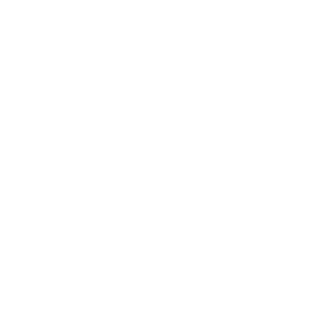

<div align="center">
  
</div>
<h1 align="center">
  Smart Dashboard (Front-end)
</h1>
<p align="center">
The frontend for my smart dashboard project. It calls the <a href="https://github.com/ben-oldham1/Smart-Dash-API">backend API</a> and displays the data in a SCI-FI style dashboard that updates asynchronously. 
</p>
<p  align="center">


</p>
 
 SCREENSHOT WILL GO HERE	

## Tiles

Each individual card on the dashboard is called a tile. For modularity, each tile contains its own logic, API calls and updates itself asynchronously. 

A variety of different tiles included in this repository, but some are not configured to show on the dashboard by default.

### Showing/hiding tiles

The `TileConfig.json` file contains a boolean for each tile, determining whether it gets rendered or not.

```
"Today": true,
"Suncycle": true,
"Bus": true,
```

To show/hide a tile, simply update the json file to indicate whether it should be rendered. If you want to rearrange the layout of the tiles, you can move around the components within the `app.js` files.

### Creating new tiles

To create a new tile, there are a few steps to take:
- Duplicate one of the existing tiles to get the basic structure. You can then add your own code.
- Name your tile in `TileConfig.json` and set to `true`.
- Add your new tile component to `App.js`, with a conditional rendering block (that uses the name you set in `TileConfig.json`).

### Changing app appearance 

There will soon be functionality to customise the global app appearance (e.g. colours, fonts, etc) from within `TileConfig.json`.


## Inspiration
I drew inspiration from a variety of sources, the most notable being:
- Territory Studio: https://territorystudio.com/project/the-martian/
- Behance: https://www.behance.net/search/projects?search=Home+Dashboard&
